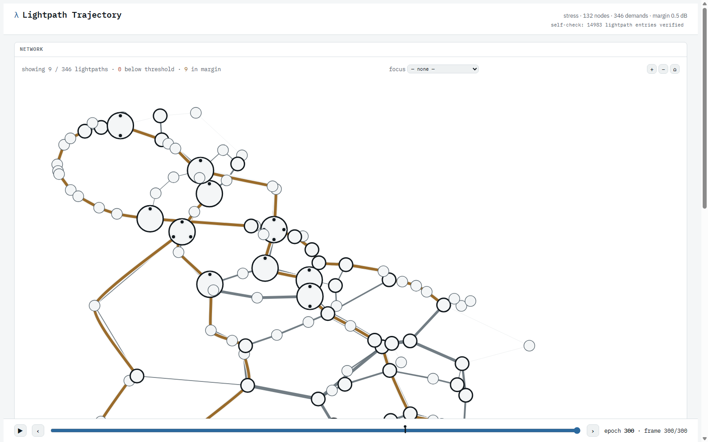

# DiffONet

DiffONet (package: `diffopt`) jointly optimizes **routing** and **regenerator
placement** for WDM (wavelength-division-multiplexed) optical networks by
backpropagating through a discrete shortest-path solver. Both decisions are
learned end to end, driven by a physically grounded, per-path GSNR
(generalized signal-to-noise ratio) estimate, using the blackbox-solver
surrogate gradient of Vlastelica et al., *Differentiation of Blackbox
Combinatorial Solvers* (ICLR 2020).

## Demo

[](https://olegkarandin.github.io/DiffRoute/demo/)

**[Live demo →](https://olegkarandin.github.io/DiffRoute/demo/)** — a
self-contained, per-epoch replay of a full training run: which lightpaths
get routed, where regenerators get placed, and how both evolve as the
constrained loss (§ below) drives the allocation toward feasibility.

## How it works

```
free per-edge weight → surrogate Dijkstra → segment at regen candidates
  → frozen QoT surrogate per segment (batched) → AllocationHead rollout
  → SegmentCombiner (exact fold) → constrained loss
```

Every edge cost is a free, directly-learned parameter; a real Dijkstra solve
picks each demand's route; the discrete choice is made differentiable by the
Vlastelica blackbox-solver surrogate gradient (re-solving on a perturbed
cost vector and reading the edge differences back as a gradient). A frozen
QoT surrogate scores each transparent segment, an autoregressive allocation
head decides where along the route to regenerate, and an exact dynamic
program folds the per-segment scores into one end-to-end GSNR per demand.
The loss enforces per-demand feasibility via an augmented-Lagrangian penalty
with per-demand dual variables, not a fixed-weight soft penalty. See
[`docs/architecture/pipeline.md`](docs/architecture/pipeline.md) for the full
stage-by-stage walkthrough, including the forward/backward diagram and every
hyperparameter's role.

## Results

| Metric | Value |
|---|---|
| QoT surrogate val RMSE (`ind_132`, 50k/10k, 100 ep) | 0.1909 dB vs 0.25 dB target (~1.4% of the 6.5-20 dB range) |
| Regenerator over-buy vs oracle-optimal, 300 ep, seed 42 | 4 devices |
| Test suite | 424 tests, `pytest tests/` |

## Install

```bash
conda create -n diffopt python=3.11 && conda activate diffopt
pip install -e ".[dev]"
```

## Quickstart

```bash
# 1. Generate a QoT training set (runs real GNPy per segment; topology
#    JSONs are already committed under configs/topology/)
python data/generate_qot_dataset.py --config configs/experiment/base.yaml

# 2. Train the QoT surrogate on the dataset produced above
python -m diffopt.qot.train_qot --config configs/experiment/base.yaml

# 3. Train the end-to-end routing + placement pipeline
python -m diffopt.train --config configs/experiment/base.yaml

# 4. Train again with a per-epoch trajectory frame dump (constrained_stress
#    already has viz.dump_frames: true) — streams logs/constrained_stress/
#    frames.jsonl during training, assembles frames.json at the end
python -m diffopt.train --config configs/experiment/constrained_stress.yaml

# 5. Build the self-contained trajectory viewer from that frame dump
python scripts/build_viewer.py \
  --frames logs/constrained_stress/frames.json \
  --out build/trajectory_viewer.html
```

## Repo map

```
diffopt/
  pipeline.py         DiffONetPipeline — wires the stages above together;
                       owns the free edge_log_weight parameter
  loss.py              compute_loss — augmented-Lagrangian feasibility /
                       device-count / route-noise terms
  topology.py           Topology (extends OpticalNetworkModel)
  demands.py             Demand generation
  modulation.py           Bitrate -> SNR threshold lookup
  routing/               The Vlastelica surrogate, shortest-path solvers
  qot/                    QoT model, GNPy bridge, segment combiner, dataset generation/training
  placement/              AllocationHead (per-(demand,boundary) regenerator
                         allocation), oracle.py (ground-truth minimal
                         allocation given fixed routes, for the acceptance gap)
  viz/                    frames.py (per-epoch trajectory dump), layout.py
                         (map layout), viewer.html (self-contained viewer
                         template)
configs/
  experiment/             Experiment YAML configs (small_test*.yaml, base.yaml)
  topology/                Committed topology JSONs + provenance (README.md)
  modulation_formats.yaml   WDM channel grid + bitrate/SNR table
data/
  generate_qot_dataset.py  QoT dataset generator (calls diffopt.qot.optical_bridge)
scripts/
  build_viewer.py          Inlines a frame dump into diffopt/viz/viewer.html
  dump_frames.py           Post-hoc trajectory dump from a saved checkpoint
  diagnose_*.py            Standalone diagnostics for individual pipeline stages
tests/                     pytest suite
docs/                      Architecture notes and the built demo (docs/demo/)
```

## Docs

- [`docs/architecture/pipeline.md`](docs/architecture/pipeline.md) — the
  single architecture reference: the standalone QoT surrogate's design and
  training setup, the full forward/backward walkthrough (above, expanded), an
  intuition-first worked example of the Vlastelica surrogate gradient, and the
  hyperparameter table
- [`docs/architecture/invariants.md`](docs/architecture/invariants.md) —
  rules that must not break, and the measured evidence behind each one
- [`docs/architecture/interfaces.md`](docs/architecture/interfaces.md) —
  component contracts and data shapes between pipeline stages

## Citations

- Vlastelica, M., Paulus, A., Musil, V., Martius, G., Rolínek, M.
  *Differentiation of Blackbox Combinatorial Solvers.* ICLR 2020.
- Karandin, O., Musumeci, F., Charlet, G., Pointurier, Y., Tornatore, M.
  *Zero-cost upgrade to a multi-fiber network with partial lane-change
  capabilities.* J. Opt. Commun. Netw. **16**, H18-H26 (2024).
  https://github.com/OlegKarandin/jocn24-multi-fiber — source of the
  `ind_132` and `jp_70` topologies under `configs/topology/`.
- `multilayer-optical-network` — upstream `OpticalNetworkModel` /
  GNPy-integration dependency this project extends and pins via git
  dependency in `pyproject.toml`.
  https://github.com/OlegKarandin/multilayer-optical-network

## License

Apache License 2.0 — see [`LICENSE`](LICENSE).
